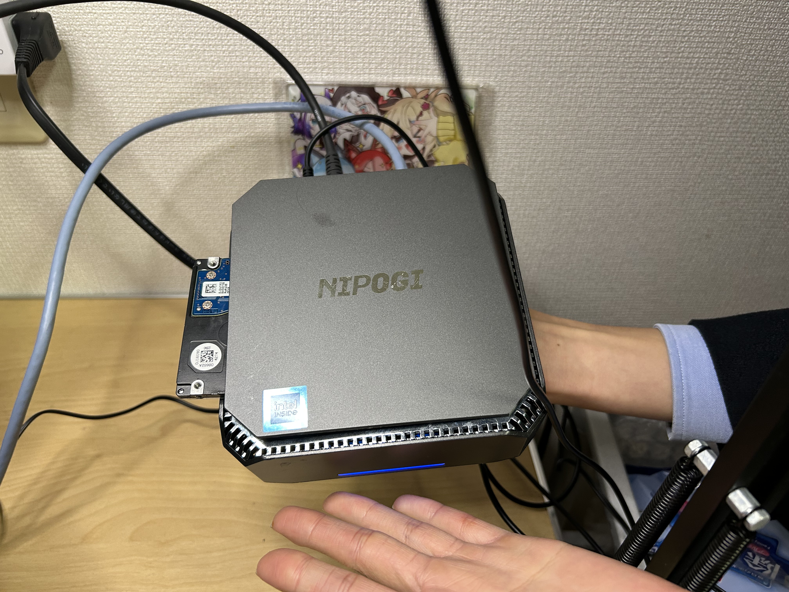
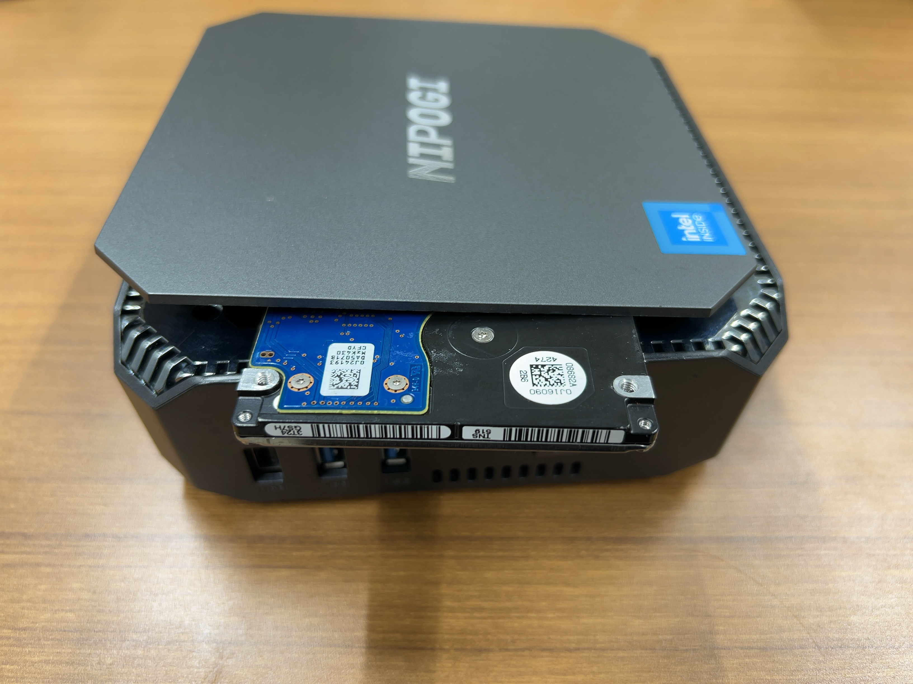
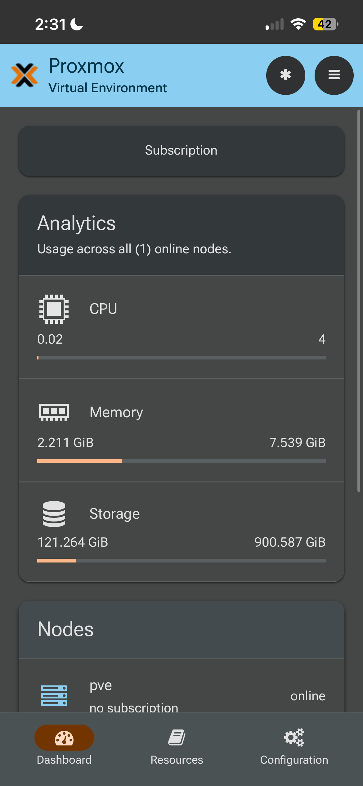
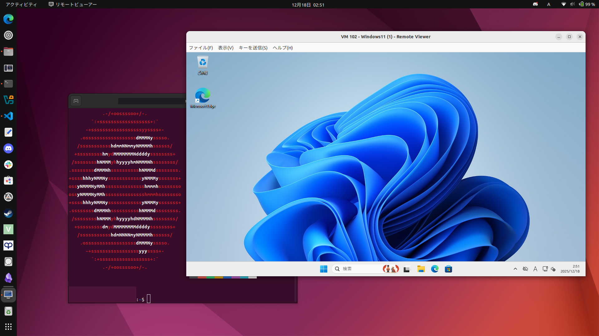
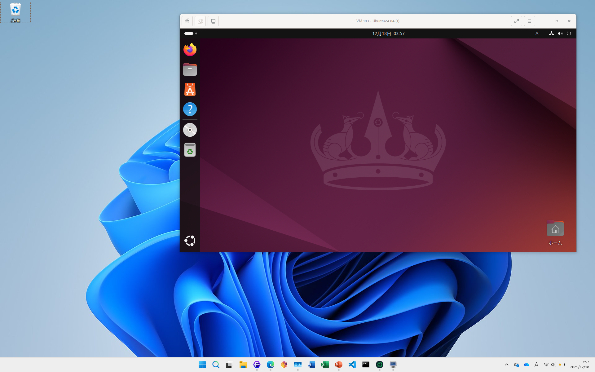
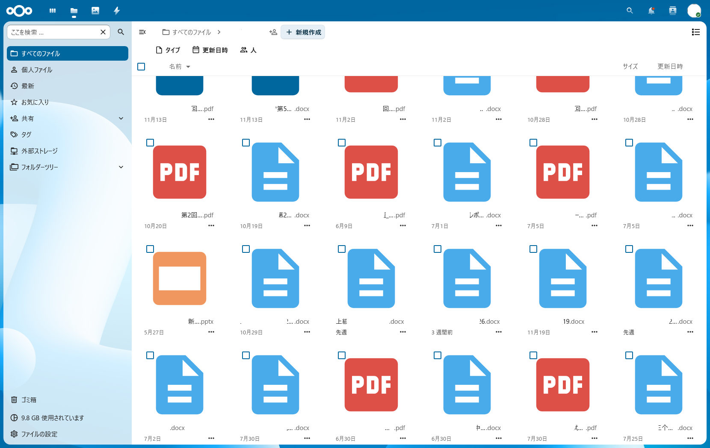
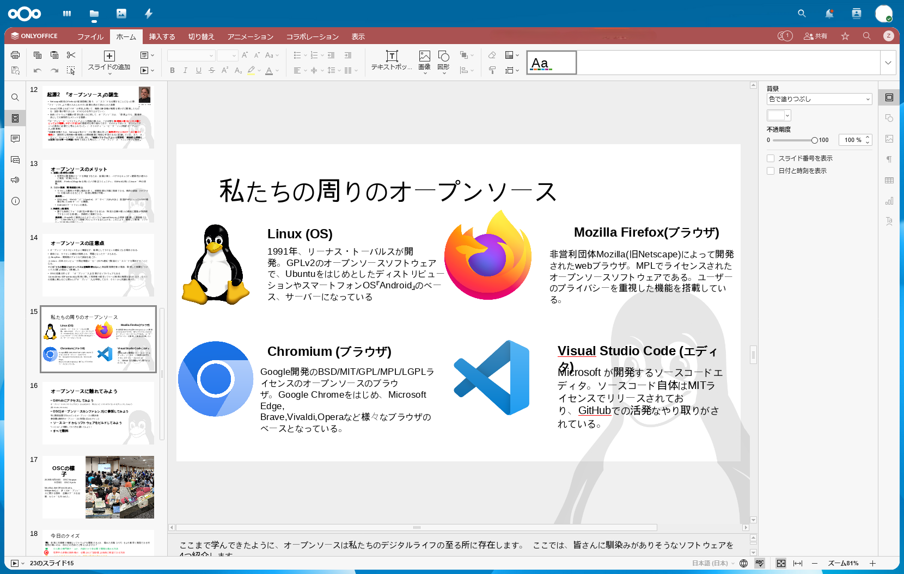
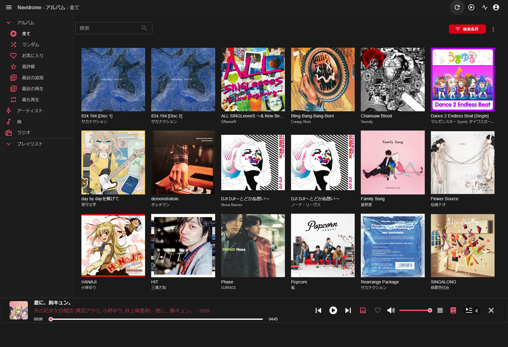
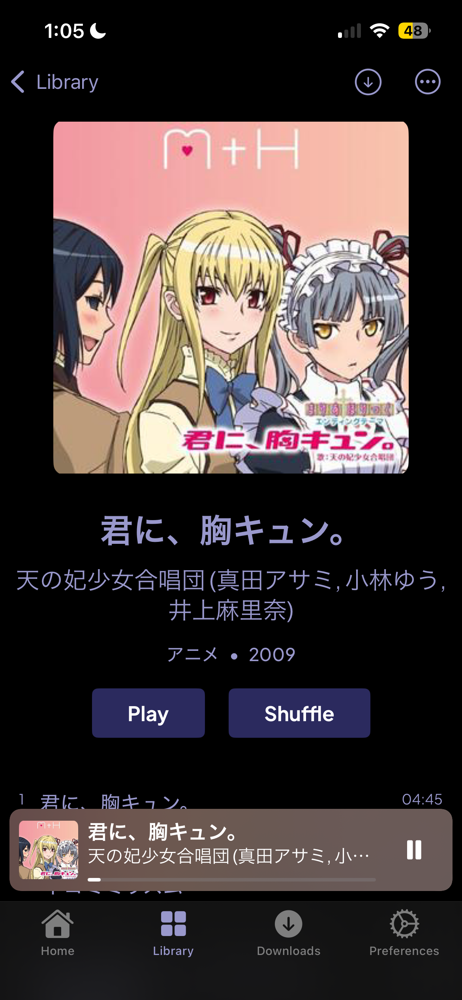

# 鯖（サーバ）のすゝめ 〜N100・8GBで始める現代の自宅クラウド〜
## はじめに
皆さんは『ミニPC』というものをご存知でしょうか。近年話題になっている小型のデスクトップPCです。CPUやメモリに、ノートパソコン用のものを採用することで、価格に対して高性能、省スペース・省電力を実現しています。  
そんなミニPCの人気の火付け役ともなったCPUがあります。それが**intel N100**です。省電力のPコアのみで構成され、前世代のCeleron N5100から1.6倍もの性能アップにより「価格の割に使える」CPUとして多くのミニPCに採用され、人気に寄与しました。  かく言う私も、その評判を聞き、試してみたいと思い、Amazonにて購入していました。ですが、具体的な使い道のないまま購入したため、そのまま放置していました。  
今回、某室アドベントカレンダーに書く内容を考えていた際、このミニPCの存在と、夏にOSC Kyotoでのボランティアでいただいた、Proxmoxの本のことを思い出し、一念発起し、「N100で自分の欲しいサーバーを作ってみる」ことにしました。
~~初心者なので、駄文になることをお許しください...~~
## Proxmoxとは？
Proxmox（プロックスモックス）は、Debian GNU/Linux をベースとした、仮想環境の構築・運用に特化したプラットフォームです。  オープンソースの仮想化基盤として、サーバー用途を中心に利用されています。
本稿では、Debian GNU/Linux を基盤とした仮想化向けディストリビューションである Proxmox VE を扱います。
### Proxmoxの特徴
#### LXCが利用できる
LXCとは、Linuxコンテナの一種で、ホストOSのカーネルを共有しながら、独立した環境を提供する技術です。LXCは、軽量で高速な仮想化を実現し、リソースの効率的な利用ができます。Proxmox VEでは、LXCコンテナを簡単に作成・管理できます。
#### Webベースのダッシュボード
Proxmox VEは、Webブラウザを通じてアクセスできるダッシュボードで、仮想マシンやコンテナの管理、リソースの監視、バックアップの設定などを行います。
## パソコンの構成
- CPU : `intel N100`
- メモリ : DDR4-3200 8GB
- ストレージ : 500GB Nvme SSD + 500GB SATA HDD  
  
SATAケーブルがあったため、ぜひ活用してみようと思ったが、いざ装着してみると、ケーブルが長すぎて、パソコン本体に入りきらないことが判明。なんとも奇妙な見た目になってしまった...

## 本邦初公開、これが私のProxmox構成だ！！
  
今回、3日間で作成した構成はこのようになった
- pve : `Proxmox VEサーバー(物理サーバー)`  
### LXC (Linuxコンテナ)
- 101 : `ct-ploxy`
- 102 : `ct-nextcloud`
- 105 : `navidrome`
### VM(仮想マシン)
- 103 : `Windows11`
- 104 : `Ubuntu 24.04 LTS`
## 機能の紹介
### TailScale
TailWireGuardをベースにしたVPNサービス。今回は、Proxmox VEサーバーに導入することで、外出先から自宅サーバーに安全にアクセスできるようにしました。

### Cloudflare Tunnel
Cloudflareが提供するトンネルサービス。Cloudflare Tunnelを利用することで、NAT環境下でも安全に自宅サーバーやホストしているWebサービスにアクセスできるようにしました。
~~友人からそそのかされて購入したドメインが初めて役に立ちました~~
### VM : Windows11
Windows11 25H2をインストール。2コア・4GBメモリを割り当てています。意外と快適に動作してビックリしました(とはいっても実用性は微妙ですが...)。

### VM : Ubuntu 24.04 LTS
Ubuntu 24.04 LTSをインストール。2コア・4GBメモリを割り当てています。こちらも快適に動作しました。

### Nextcloud
自宅運用で定番のクラウドストレージサービス。LXCコンテナで構築し、HDDをデータ保存用にマウント、Cloudflare Tunnelで外出先からもアクセスできるようにしました。大学で配布されているOneDriveに容量制限があるため、個人で大容量のクラウドストレージを持ちたいという目的で導入しました。アプリを追加することで、サーバー内でドキュメントの編集も可能です。

### Navidrome
音楽ストリーミングサーバー。LXCコンテナで構築し、HDDをデータ保存用にマウント、Cloudflare Tunnelで外出先からもアクセスできるようにしました。サブスクも好きなのですが、解禁されていない曲がしばしばあるため、自分の手持ちの音楽をストリーミングで聴きたいという目的で導入しました。サードパーティ製のクライアントアプリも充実しており、スマホからも快適に再生できます。

## おわりに
N100・8GBメモリという、決してハイスペックとは言えない環境でのProxmox VE導入でしたが、意外と快適に動作し、満足しています。  
今回構築したサーバーは、あくまで私個人の趣味・実験用のサーバーですが、Proxmoxを利用することで、様々なサービスを手軽に試すことができました。  
皆さんも、ぜひ冬休みにでも，自分だけのサーバー環境を構築してみてはいかがでしょうか。